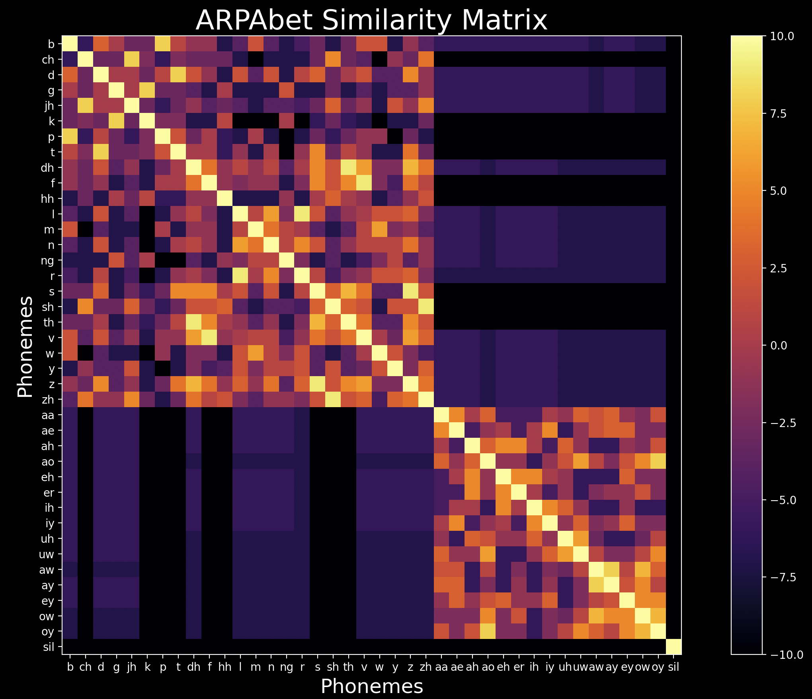

# cacoepy
cacoepy is a small collection of tools related to mispronunciation detection and diagnosis (MDD) systems.

___

## Installation
Download this repository and then run:
`pip install cacoepy`


## Phoneme Alignment
The `AlignARPAbet2` class is used to align two sequences of ARPAbet phonemes, taking into account phoneme similarities. Typically sequence aligners focus on identifying matches and mismatches. However, for a more realistic alignment of phonemes in mispronounced speech versus the intended phonemes, it is important to consider the similarity between phoneme pairs.

### Usage
When creating the instance, specify a gap penalty. A more negative value discourages the insertion of gaps.
```python
from cacoepy.aligner import AlignARPAbet2

aligner = AlignARPAbet2(gap_penalty=-4)
target_phonemes = "th er m aa m ah t er".split(" ")
mispronounced_phonemes = "uw ao m eh d er".split(" ")

aligned_mispronounced, aligned_target, score = aligner(mispronounced_phonemes, target_phonemes)

```

**Resulting Alignment**:
```
th  er  m  aa  m  ah  t  er
-   uw  -  ao  m  eh  d  er
```
In this example, many of the phonemes are substituted or deleted in this child’s transcription of “thermometer.” Despite this, the `AlignARPAbet2` has found a good alignment by factoring in the similarities between pairs such as *er* and *uw*. For comparison, the Python package `Levenshtein editops` alignment of the same sequences was:

```
th  er  m  aa  m  ah  t  er
uw  ao  m  eh  d  -   -  er
```
Where it only aligns based on exact matches.


### Implementation
The `AlignARPAbet2` uses the **Needleman-Wunsch** algorithm with a custom similarity matrix for assigning scores to phoneme pairs. To generate the similarity matrix, the phonemes are broken down into their 35 attributes, which describe how they are articulated. Each phoneme may have several attributes each (see `data/ARPAbet_mapping.json` for the breakdown). By signifying which attributes are present or not, each phoneme is represented as a vector in a 35-dimensional attribute space. Then, the cosine similarity is calculated between each pair of phoneme vectors and placed into a lookup table to be used to inform the **Needleman-Wunsch** algorithm during alignment.
A visual representation of the similarity matrix is shown below. The clear separation of consonants and vowels is apparent in the sub-squares.


<div align="center">
    
</div>

