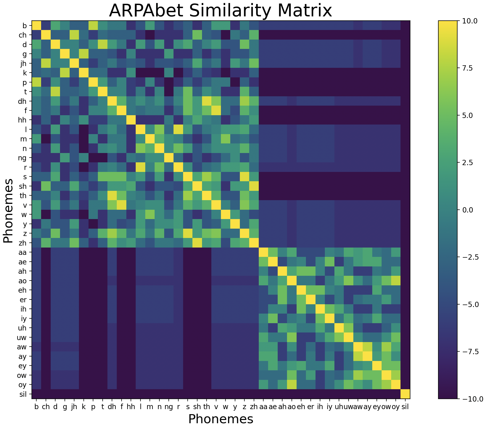

# cacoepy
cacoepy is a toolkit designed for aligning sequences of phonemes, considering phoneme similarities. It was created to aid in the evaluation of mispronunciation diagnosis detection (MDD) systems, where a speaker's mispronunciations of a word at the phoneme level are evaluated against the target word's phonemes. This process requires alignment methods that factor in the similarities between certain phonemes.

**Example:**

|             | 1  | 2  | 3  | 4  | 5  | 6  | 7  | 8  |
|-------------|----|----|----|----|----|----|----|----|
| **Target**    | th | er | m  | aa | m  | ah | t  | er |
| **Standard** | -  | -  | uw | ao | m  | eh | d  | er |
| **Cacoepy** | -  | uw | -  | ao | m  | eh | d  | er |

|             | 1  | 2  | 3  | 4  | 5  | 6  | 7  | 
|-------------|----|----|----|----|----|----|----|
| **Target**    | d | ay | n  | ay | s  | ao | r| 
| **Standard** | d  | -  | - | - | ih | k | ow | 
| **Cacoepy** | d  | -| -  | ih | k  | ow | -  | 

|             | 1  | 2  | 3  | 4  |
|-------------|----|----|----|----|
| **Target**    | -|s | k | uw  | l | 
| **Standard** | -|g  | w  | uh | l |
| **Cacoepy** |s |g  | -| -  | ih |

___

## Installation
Download this repository and then run:
`pip install .`

## Method
The alignment tools in this package use the **Needleman-Wunsch** algorithm in conjunction with a custom phoneme similarity matrix for assigning a similarity score between each phoneme pair. Currently only the ARPAbet phonemes are supported.

The similarity matrix is constructed by breaking each phoneme into 34 attribute componants. Then each phoneme is represented as a vector in an attribute space. Each pairing of vectors has there cosine similiarty calculated and placed into a 2D matrix which can be used as a lookup table.

    

